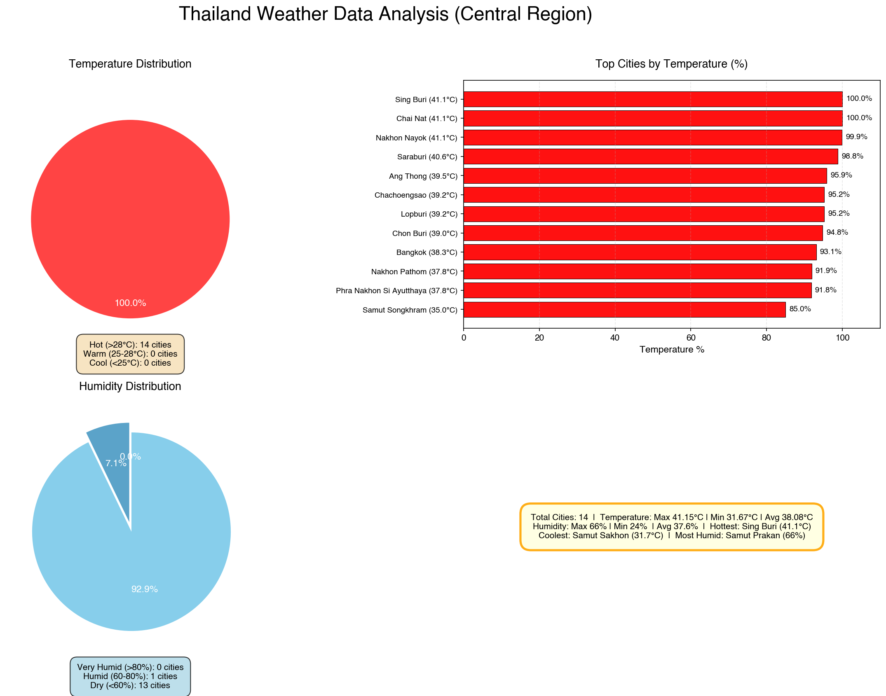

# Weather ETL Pipeline 🌤️

Production-ready ETL pipeline for collecting, processing, and analyzing weather data from OpenWeatherMap API. The pipeline is designed for scalability, maintainability, and deployment to AWS Lambda.

## 🎯 Features

- **Automated Data Collection**: Fetches real-time weather data from OpenWeatherMap API
- **Data Validation**: Pydantic-based validation ensures data quality
- **Cloud-Native**: Built for AWS Lambda with S3 Data Lake
- **Scalable**: Supports batch processing of multiple cities
- **Monitoring**: CloudWatch integration for logging and alerts
- **Infrastructure as Code**: Terraform templates for reproducible deployments
- **CI/CD Pipeline**: GitHub Actions automated testing and deployment
- **Comprehensive Tests**: 80%+ code coverage with pytest
- **Docker Support**: Containerized deployment ready

## 📋 Table of Contents

- [Quick Start](#quick-start)
- [Architecture](#architecture)
- [Installation](#installation)
- [Configuration](#configuration)
- [Usage](#usage)
- [Testing](#testing)
- [Deployment](#deployment)
- [Monitoring](#monitoring)
- [Contributing](#contributing)

## 🚀 Quick Start

### Local Development

```bash
# Clone the repository
git clone https://github.com/your-repo/weather-elt-pipeline.git
cd weather-elt-pipeline

# Create virtual environment
python -m venv venv
source venv/bin/activate  # On Windows: venv\Scripts\activate

# Install dependencies
make install

# Copy environment template
cp .env.example .env

# Add your OpenWeatherMap API key
# Get one at: https://openweathermap.org/api

# Run the pipeline
make run

# Run tests
make test
```

### Docker

```bash
# Build Docker image
make docker-build

# Run with Docker Compose
make docker-run

# View logs
make docker-logs

# Stop services
make docker-stop
```

## 🏗️ Architecture

```
OpenWeatherMap API
       ↓
  Extract (requests)
       ↓
  Transform (pandas + Pydantic)
       ↓
  Load (S3 Parquet)
       ↓
  S3 Data Lake
       ↓
  AWS Athena (SQL Queries)
```

### Deployment Architecture

```
CloudWatch Events (Daily 9 AM)
       ↓
AWS Lambda (Python 3.11)
       ↓
S3 Bucket (Partitioned Data)
       ↓
AWS Athena (Analytics)
```

See [ARCHITECTURE.md](./ARCHITECTURE.md) for detailed design decisions.

## 📥 Installation

### Prerequisites

- Python 3.11+
- pip or conda
- AWS Account (for cloud deployment)
- Docker & Docker Compose (optional)

### Setup

1. **Clone repository**
   ```bash
   git clone https://github.com/your-repo/weather-elt-pipeline.git
   cd weather-elt-pipeline
   ```

2. **Create virtual environment**
   ```bash
   python -m venv venv
   source venv/bin/activate
   ```

3. **Install dependencies**
   ```bash
   pip install -r requirements.txt
   ```

4. **Get API Key**
   - Visit https://openweathermap.org/api
   - Sign up for free account
   - Get your API key

5. **Configure environment**
   ```bash
   cp .env.example .env
   ```
   Edit `.env` and add your:
   - `WEATHER_API_KEY`
   - `AWS_ACCESS_KEY_ID`
   - `AWS_SECRET_ACCESS_KEY`

## ⚙️ Configuration

### Environment Variables

```
# API Configuration
WEATHER_API_KEY=your_api_key_here
API_TIMEOUT=10

# AWS Configuration
AWS_ACCESS_KEY_ID=your_access_key
AWS_SECRET_ACCESS_KEY=your_secret_key
AWS_REGION=ap-southeast-1
AWS_S3_BUCKET=weather-elt-pipeline-{account_id}

# Logging
LOG_LEVEL=INFO
LOG_FILE=logs/weather_etl.log

# Application
MAX_RETRIES=3
BATCH_SIZE=50
```

See `.env.example` for all available options.

## 💻 Usage

### Run Pipeline Locally

```bash
# Run with default cities
python main.py

# View logs
tail -f logs/weather_etl.log
```

### Run Lambda Handler Locally

```bash
python -c "from src.lambda_handler import lambda_handler; \
class C: aws_request_id='test'; \
lambda_handler({'cities': ['Bangkok']}, C())"
```

### Using Makefile

```bash
# Run tests
make test

# Format code
make format

# Lint code
make lint

# Type check
make type-check

# Run all checks
make quality
```

## 🧪 Testing

### Run All Tests

```bash
# With coverage report
pytest tests/ -v --cov=src --cov-report=html

# View HTML report
open htmlcov/index.html
```

### Run Specific Tests

```bash
# Test extraction
pytest tests/test_extract.py -v

# Test transformation
pytest tests/test_transform.py -v

# Test loading
pytest tests/test_load.py -v
```

### Test Coverage

Target: 80%+ coverage

```bash
pytest tests/ --cov=src --cov-report=term-missing
```

## ☁️ Deployment

### AWS Lambda Deployment

1. **First Time Setup**
   ```bash
   cd infrastructure
   terraform init
   terraform plan
   terraform apply
   ```

2. **Update Lambda**
   ```bash
   cd src && zip -r ../lambda_function.zip . && cd ..
   aws lambda update-function-code \
     --function-name weather-etl-pipeline \
     --zip-file fileb://lambda_function.zip
   ```

3. **Monitor Execution**
   ```bash
   aws logs tail /aws/lambda/weather-etl-pipeline --follow
   ```

### Using GitHub Actions

1. **Set AWS Credentials in GitHub Secrets**
   - `AWS_ACCESS_KEY_ID`
   - `AWS_SECRET_ACCESS_KEY`

2. **Create Release Tag**
   ```bash
   git tag v1.0.0
   git push origin v1.0.0
   ```

3. **Monitor Deployment**
   - Check GitHub Actions tab
   - View deployment logs
   - Verify Lambda function metrics

## 📊 Monitoring

### CloudWatch Logs

```bash
# View Lambda logs
aws logs tail /aws/lambda/weather-etl-pipeline --follow

# Query logs
aws logs filter-log-events \
  --log-group-name /aws/lambda/weather-etl-pipeline
```

### CloudWatch Metrics

Available metrics:
- `Invocations`: Number of Lambda invocations
- `Duration`: Execution time
- `Errors`: Number of failures
- `ConcurrentExecutions`: Concurrent executions

### Alarms

Configured alarms:
- Lambda duration > 80% timeout
- Lambda execution errors
- S3 upload failures

## 🤝 Contributing

### Development Workflow

1. **Create feature branch**
   ```bash
   git checkout -b feature/my-feature
   ```

2. **Make changes**
   ```bash
   # Write code, add tests
   ```

3. **Run quality checks**
   ```bash
   make quality
   ```

4. **Commit and push**
   ```bash
   git add .
   git commit -m "feat: describe your feature"
   git push origin feature/my-feature
   ```

5. **Create Pull Request**
   - Describe changes
   - Link related issues
   - Wait for CI checks to pass

## 📝 Project Structure

```
weather-elt-pipeline/
├── src/
│   ├── extract.py              # Data extraction
│   ├── transform.py            # Data transformation
│   ├── load.py                 # Data loading
│   ├── lambda_handler.py       # AWS Lambda entry point
│   └── utils/                  # Utility modules
│       ├── logger.py           # Logging config
│       ├── config.py           # Configuration
│       ├── retry.py            # Retry logic
│       └── validators.py       # Data validation
├── tests/                      # Unit tests
├── infrastructure/             # Terraform IaC
├── .github/workflows/          # CI/CD pipelines
├── Dockerfile                  # Container image
├── docker-compose.yml          # Local development
├── requirements.txt            # Python dependencies
├── Makefile                    # Common commands
└── README.md                   # This file
```

## 📚 Documentation

- [ARCHITECTURE.md](./ARCHITECTURE.md) - Design decisions and architecture
- [API Documentation](./docs/API.md) - Detailed API docs
- [Deployment Guide](./docs/DEPLOYMENT.md) - Production deployment

## 🔒 Security

- API keys stored in `.env` (not committed)
- AWS credentials from `~/.aws/credentials`
- IAM roles with least-privilege principle
- S3 bucket encryption enabled
- Public access blocked

## 📄 License

MIT License - see LICENSE file for details

## 📊 Data Visualization

The pipeline generates automated Tableau-style dashboards with the following visualizations:



**Dashboard Features:**
- **Temperature Distribution** (Pie Chart) - Categorizes cities by temperature ranges (Hot/Warm/Cool)
- **Top Cities by Temperature** (Horizontal Bar Chart) - Shows top 12 cities with temperature percentages
- **Humidity Distribution** (Pie Chart) - Categorizes cities by humidity levels
- **Weather Statistics** (Summary Box) - Key metrics including min/max/avg temperatures and humidity

## 🙏 Acknowledgments

- OpenWeatherMap API
- AWS Lambda & S3 services
- Python community (pandas, pydantic, pytest)

---

**Last Updated**: 2026-03-31
**Version**: 1.0.0
**Maintainer**: Data Engineering Team
